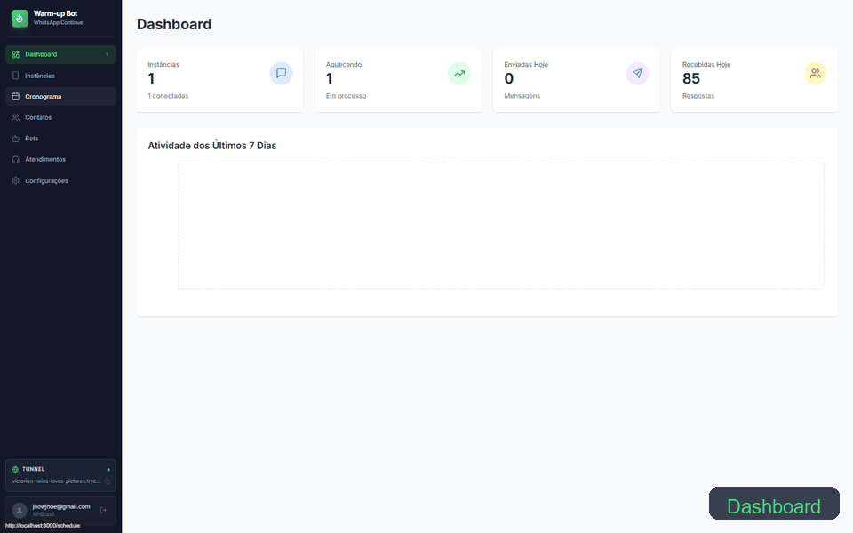

# 🤖 Warm-up Bot

**POC** — Sistema de aquecimento automatizado de chips WhatsApp com conversas geradas por IA.

O Warm-up Bot automatiza o processo de aquecimento de contas WhatsApp enviando conversas progressivas ao longo de 8 dias, aumentando gradualmente o volume para reduzir risco de banimento. As conversas são geradas pelo ChatGPT com linguagem natural em português brasileiro.

---

## Funcionalidades

- **Aquecimento automatizado em 8 fases** — progressão de 10 a 80 conversas/dia com intervalos decrescentes
- **Conversas geradas por IA** — ChatGPT produz diálogos realistas com gírias brasileiras e tópicos variados
- **Gerenciamento de instâncias WhatsApp** — criar, conectar via QR Code e monitorar múltiplas instâncias
- **Dashboard com métricas em tempo real** — acompanhamento via Server-Sent Events (SSE) e gráficos
- **Sistema de atendimento** — bots automatizados com handoff para atendentes humanos
- **Túnel Cloudflare** — exposição automática de webhooks sem port forwarding
- **Suporte multi-servidor** — WPP e Baileys via APIBrasil com roteamento automático

## Tech Stack

| Camada    | Tecnologias                                                  |
|-----------|--------------------------------------------------------------|
| Frontend  | React 18, TypeScript, Vite, TailwindCSS, Recharts            |
| Backend   | Node.js, Express, TypeScript, Sequelize ORM                  |
| Banco     | MySQL (utf8mb4)                                              |
| IA        | OpenAI SDK (ChatGPT)                                         |
| WhatsApp  | APIBrasil (WPP / Baileys)                                    |
| Infra     | Cloudflare Tunnel, APIBrasil, Helmet.js, node-cron           |

## Estrutura do Projeto

```
warm-up-bot/
├── client/                 # Frontend React
│   └── src/
│       ├── components/     # Sidebar, InstanceCard, QrCodeModal, PhaseProgress
│       ├── pages/          # Dashboard, Instances, Contacts, Bots, Settings...
│       ├── contexts/       # AuthContext
│       └── hooks/          # useApi, useStatusStream
├── server/                 # Backend Express
│   └── src/
│       ├── config/         # Database (Sequelize) e variáveis de ambiente
│       ├── models/         # Instance, WarmingContact, Conversation, Message...
│       ├── migrations/     # Schema e runner de migrações
│       ├── routes/         # auth, instances, contacts, webhooks, metrics, sse...
│       ├── services/       # apibrasil, chatgpt, warming, tunnel, webhook...
│       ├── middleware/     # Autenticação JWT
│       └── utils/          # Criptografia AES-256
├── QUICKSTART.md           # Guia de início rápido
└── SECURITY.md             # Documentação de segurança
```

## Pré-requisitos

- **Node.js** 18+
- **MySQL** 8.0+
- Conta na **[APIBrasil](https://apibrasil.com.br)** com SecretKey
- **API Key** da [OpenAI](https://platform.openai.com/api-keys)

## Instalação

### 1. Instalar dependências

```bash
npm install
```

### 2. Criar o banco de dados

```sql
CREATE DATABASE esquenta_chips CHARACTER SET utf8mb4 COLLATE utf8mb4_unicode_ci;
```

### 3. Configurar variáveis de ambiente

Copie o arquivo de exemplo e edite:

```bash
cp server/.env.example server/.env
```

Preencha o `server/.env`:

```env
ENCRYPTION_KEY=sua_chave_aleatoria_32_caracteres
DB_HOST=localhost
DB_PORT=3306
DB_NAME=esquenta_chips
DB_USER=root
DB_PASS=sua_senha
PORT=3001
NODE_ENV=development
WEBHOOK_URL=http://localhost:3001/api/webhooks
```

Para gerar uma chave de criptografia segura (PowerShell):

```powershell
-join ((48..57) + (65..90) + (97..122) | Get-Random -Count 32 | % {[char]$_})
```

### 4. Executar migrações

```bash
cd server
npm run migrate
```

### 5. Iniciar

```bash
npm run dev
```

| Serviço  | URL                        |
|----------|----------------------------|
| Frontend | http://localhost:3000       |
| Backend  | http://localhost:3001       |

### 6. Configuração inicial (primeira vez)

1. Acesse http://localhost:3000 e vá em **Configurações**
2. Informe email/senha da APIBrasil e a SecretKey
3. Cole sua API Key da OpenAI e escolha o modelo (recomendado: `gpt-4o-mini`)
4. Salve — as credenciais ficam criptografadas no banco

## Scripts Disponíveis

| Comando                | Descrição                              |
|------------------------|----------------------------------------|
| `npm run dev`          | Inicia server + client (dev)           |
| `npm run dev:server`   | Inicia apenas o backend                |
| `npm run dev:client`   | Inicia apenas o frontend               |
| `npm run build`        | Build de produção (client + server)    |
| `npm start`            | Inicia em modo produção                |

Migrações (executar dentro de `server/`):

| Comando                | Descrição                              |
|------------------------|----------------------------------------|
| `npm run migrate`      | Executar migrações pendentes           |
| `npm run migrate:down` | Reverter última migração               |
| `npm run migrate:status` | Verificar status das migrações       |

## Cronograma de Aquecimento

O sistema executa automaticamente entre **08h e 22h** com variação aleatória de ±20% nos intervalos:

| Dia | Conversas | Intervalo |
|-----|-----------|-----------|
| 1   | 10        | 60 min    |
| 2   | 20        | 30 min    |
| 3   | 30        | 20 min    |
| 4   | 40        | 15 min    |
| 5   | 50        | 10 min    |
| 6   | 60        | 8 min     |
| 7   | 70        | 7 min     |
| 8   | 80        | 6 min     |

## Geração de Conversas (ChatGPT)

As conversas são geradas com as seguintes características:

- **Tópicos variados** — futebol, trabalho, família, viagens, comida etc.
- **Linguagem natural** — gírias brasileiras (blz, tmj, vlw, kk)
- **Mix de tipos** — 70% texto, 15% áudio, 10% imagem, 5% sticker
- **Respostas contextuais** — responde com base nas mensagens recebidas

## 🎥 Demonstração

<p align="center">
  
</p>

## Screenshot API


## Licença

MIT
